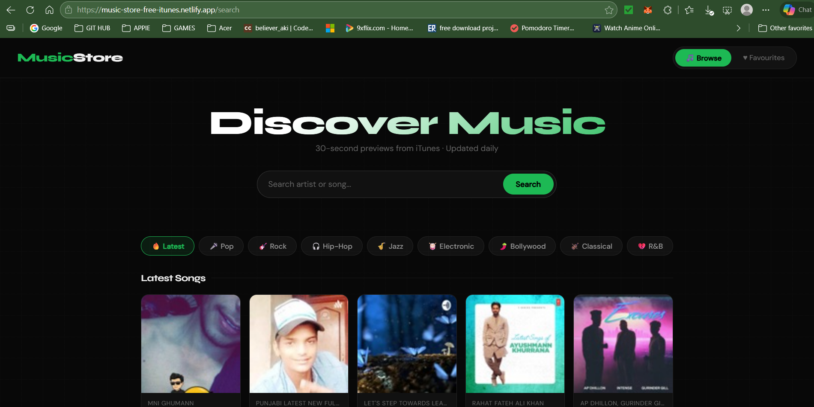
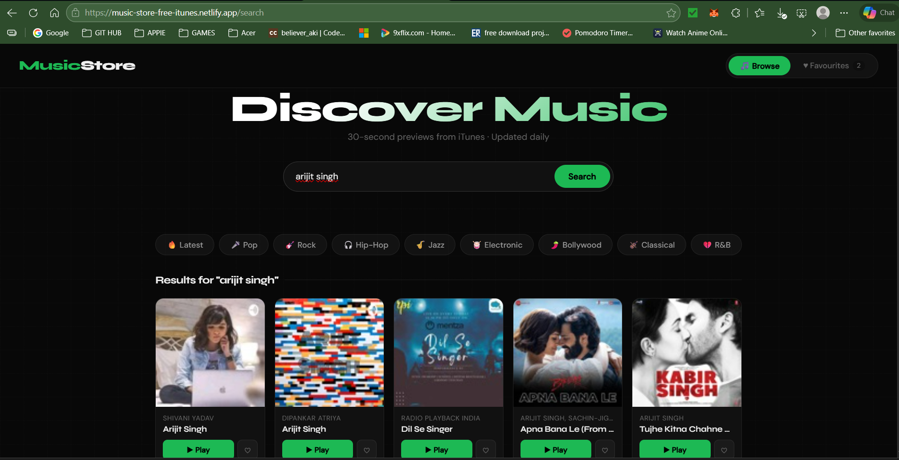
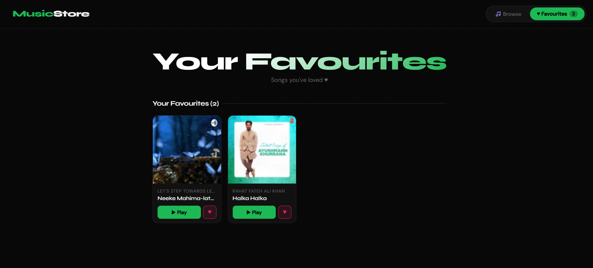

# 🎵 Music Store

A production-grade React music discovery app powered by the **iTunes Search API**. Browse songs by genre, search any artist or track, play 30-second previews, and save your favourites — all with a clean dark UI.

**Live Demo →** [music-store-free-itunes.netlify.app](https://music-store-free-itunes.netlify.app/)


---

## 📸 Screenshots

| Home Page | Search Results | Favourites |
|---|---|---|
|  |  |  |

---

## ✨ Features

- 🔍 **Search** — Search songs or artists via the iTunes API
- 🎛️ **Genre Tabs** — Filter by Latest, Pop, Rock, Hip-Hop, Jazz, Electronic, Bollywood, Classical, R&B
- 🎵 **30-Second Previews** — Play audio with a custom progress bar, seek, and play/pause controls
- ♥ **Favourites** — Heart songs and view them in a dedicated tab (persisted to `localStorage`)
- 📄 **Pagination** — Loads 20 songs at a time with a "Load More" button
- 💀 **Skeleton Loading** — Shimmer placeholder cards during API fetch
- ⚠️ **Error Handling** — Graceful error state if the API call fails
- 📱 **Responsive** — Works on mobile, tablet, and desktop
- 🔗 **React Router** — `/search` and `/player` routes with full browser back/forward support

---

## 🛠️ Tech Stack

| Layer | Technology |
|---|---|
| UI Framework | React 18 |
| Routing | React Router v6 |
| HTTP Client | Axios |
| Data Source | iTunes Search API (Apple — no key required) |
| Styling | Custom CSS with CSS Variables + Google Fonts |
| Fonts | Syne (headings) + DM Sans (body) |
| State | useState, useRef, useCallback |
| Persistence | localStorage via custom `useFavorites` hook |
| Build Tool | Create React App (react-scripts 5) |
| Deployment | Netlify |

---

## 📁 Project Structure

```
src/
├── index.js                 # Entry point — ReactDOM.createRoot, BrowserRouter
├── App.js                   # Route definitions (/search, /player)
├── index.css                # Design system — CSS variables, grid, animations
│
├── pages/
│   ├── SearchPage.jsx       # Main page — navbar, genre tabs, search, song grid
│   └── PlayerPage.jsx       # Player route — reads router state, renders Player
│
├── components/
│   ├── Search.jsx           # Uncontrolled search input with Enter key support
│   ├── GenreTabs.jsx        # Data-driven genre filter tabs
│   ├── Songs.jsx            # Responsive song grid with empty state handler
│   ├── Song.jsx             # Individual card — artwork, play button, fav button
│   ├── SkeletonCard.jsx     # Shimmer loading placeholder
│   └── Player.jsx           # Audio player — progress bar, seek, play/pause
│
├── hooks/
│   ├── useSongs.js          # Fetch + loading + error + pagination (useCallback, useRef)
│   └── useFavorites.js      # localStorage persistence (lazy init + useEffect sync)
│
└── services/
    └── api-client.js        # Axios call to iTunes API — isolated service layer
```

---

## 🚀 Getting Started

### Prerequisites

- Node.js `v16+`
- npm `v8+`

### Installation

```bash
# 1. Clone the repository
git clone https://github.com/AashishPathak1/Music-Store-New-Version.git

# 2. Navigate into the project
cd Music-Store-New-Version

# 3. Install dependencies
npm install

# 4. Start the development server
npm start
```

App runs at **http://localhost:3000** and opens automatically in your browser.

---

## 🌐 Deployment

This project is deployed on **Netlify**. The `public/_redirects` file handles React Router's client-side routing:

```
/*    /index.html    200
```

> Without this file, refreshing `/player` or `/search` returns a 404 because Netlify tries to find a real file at that path instead of serving `index.html` and letting React Router handle it.

### Deploy your own fork

```bash
# Build
npm run build

# Option A — Netlify CLI
npm install -g netlify-cli
netlify deploy --prod --dir=build

# Option B — Drag and drop the build/ folder at netlify.com/drop

# Option C — Vercel (also free, zero config)
npm install -g vercel
vercel
```

> If deploying to **Vercel**, create a `vercel.json` in the project root instead of `_redirects`:
> ```json
> { "rewrites": [{ "source": "/(.*)", "destination": "/index.html" }] }
> ```

---

## 🔑 Environment Variables

This project uses the **public iTunes Search API** — no API key or `.env` file is required.

If you integrate the Spotify API in the future:

```env
REACT_APP_SPOTIFY_CLIENT_ID=your_client_id
REACT_APP_SPOTIFY_CLIENT_SECRET=your_client_secret
```

> In Create React App, all env variables must be prefixed with `REACT_APP_` to be accessible in the browser bundle.

---

## 🗺️ Roadmap — Future Enhancements

### 🔥 High Impact (Next Steps)

| Feature | Why | How |
|---|---|---|
| **Debounced live search** | Fire API 500ms after typing stops — no button needed | `useDebounce` hook, switch Search to controlled input |
| **Mini player bar** | Keep playing while browsing — like Spotify | Fixed bottom bar, lift `currentSong` to App level |
| **Auto-play next song** | Keep users engaged after 30s preview ends | Call `onNext` prop in Player's `onEnded` handler |
| **React Query** | Caching, background refetch, deduplication | Replace `useSongs` with `useQuery` from `@tanstack/react-query` |

### 🎨 UI / UX

| Feature | Why | How |
|---|---|---|
| **Dark / Light mode** | Accessibility + user preference | CSS variable swap via `<body>` class, persisted to localStorage |
| **Animated page transitions** | Polished, app-like feel | `framer-motion` `<AnimatePresence>` around `<Routes>` |
| **Sort songs** | Sort by artist, name, or relevance | `.sort()` on songs array before rendering |
| **Share button on Player** | Easy sharing | Web Share API: `navigator.share({ title, url })` |

### ⚡ Performance

| Feature | Why | How |
|---|---|---|
| **Image lazy loading** | Faster initial paint | `` — native, zero JS cost |
| **React.memo on Song card** | Prevent unnecessary re-renders | `export const Song = React.memo(...)` |
| **AbortController in search** | Prevent race conditions on fast typing | Cancel in-flight request before starting new one |
| **List virtualisation** | Smooth rendering of 500 cards | `react-window` `FixedSizeGrid` |

### 🔐 Backend & Auth (Advanced)

| Feature | Why | How |
|---|---|---|
| **User authentication** | Personal data across devices | Firebase Auth or Clerk (Google/GitHub sign-in) |
| **Cloud-synced favourites** | Survive across devices and browsers | Replace localStorage with Firestore or Supabase |
| **Playlist creation** | Core music app feature | `usePlaylists` hook + playlist management page |
| **Spotify API** | Full-length songs instead of 30s previews | OAuth 2.0 PKCE flow, swap `previewUrl` for Spotify URI |
| **Node.js proxy** | Rate limiting, caching, API key protection | Express `/api/search`, deploy on Railway |

### 🧪 Testing

| Type | Tool | What to Test |
|---|---|---|
| Unit | Jest | `useSongs`, `useFavorites` hook logic |
| Component | React Testing Library | Song card render, fav toggle, skeleton display |
| API mock | MSW (Mock Service Worker) | Simulate iTunes responses without real network |
| E2E | Playwright or Cypress | Search → play → favourite full user flow |

---

## 🐛 Known Issues

| Issue | Cause | Status |
|---|---|---|
| Audio `play()` AbortError on first load | Browser autoplay policy + React StrictMode | ✅ Fixed — `await play()` + `onCanPlay` ready guard |
| Songs can repeat across searches | iTunes API returns overlapping results | 🔧 Can deduplicate by `trackId` after fetch |
| Missing artwork on some cards | Some iTunes results have no `artworkUrl100` | 🔧 Add fallback image: `song.artworkUrl100 \|\| '/placeholder.png'` |

---

## 💡 What I Learned Building This

- **Custom hooks** separate data concerns from UI — `useSongs` and `useFavorites` are independently reusable and testable
- **React Router state** is the correct way to pass complex objects between routes without URL-encoding them
- **Browser media APIs** (HTMLAudioElement) are imperative — `useRef` is the right pattern for integrating with them, not `useState`
- **`"type": "module"`** in `package.json` enforces strict ESM — every import must include the full file extension (`.js`, `.jsx`)
- **CSS custom properties** are the foundation of a scalable design system — one variable change propagates to every element that uses it
- **Skeleton screens** reduce perceived load time — they preserve spatial layout so content doesn't cause a jarring layout shift when it arrives
- **`await audio.play()`** — the browser's play() returns a Promise; not awaiting it was the root cause of the AbortError crash

---

## 📜 License

MIT — free to use, modify, and distribute.

---

## 🙏 Acknowledgements

- [iTunes Search API](https://developer.apple.com/library/archive/documentation/AudioVideo/Conceptual/iTuneSearchAPI/) — Apple's free public music search endpoint
- [React](https://react.dev/) — UI framework
- [React Router](https://reactrouter.com/) — Client-side routing
- [Axios](https://axios-http.com/) — HTTP client
- [Google Fonts](https://fonts.google.com/) — Syne & DM Sans typefaces
- [Netlify](https://netlify.com/) — Deployment platform

---

<div align="center">
  <strong>Made with ♥ by Aashish Pathak</strong><br/>
  <a href="https://music-store-free-itunes.netlify.app/">Live Demo</a> •
  <a href="https://github.com/AashishPathak1/Music-Store-New-Version">GitHub</a>
</div>